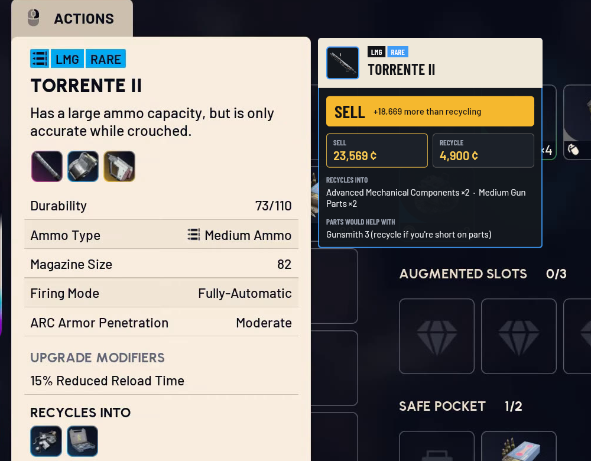
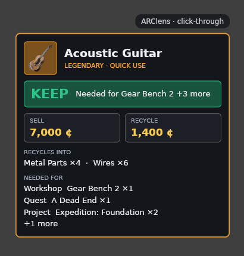
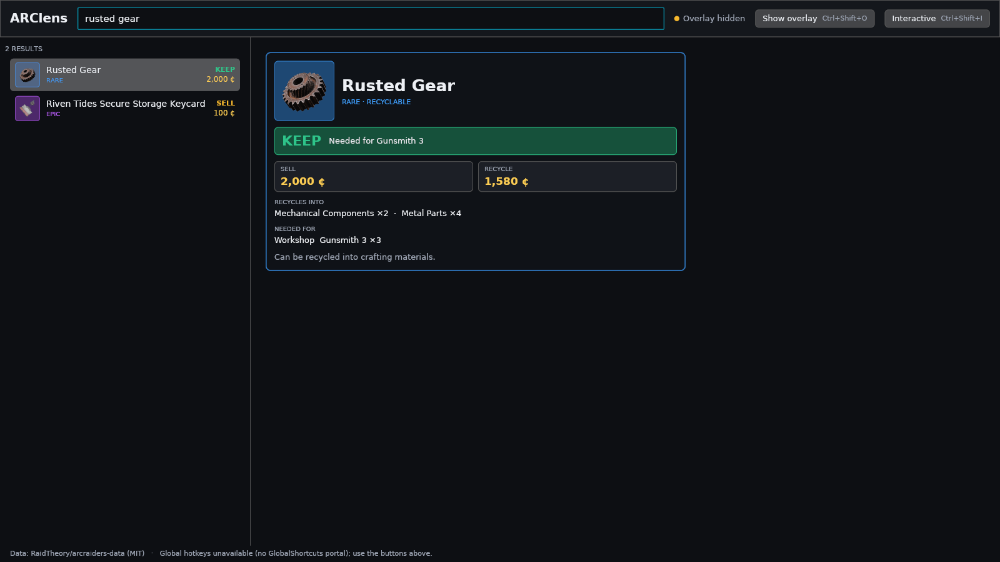

# ARClens

ARClens is a companion app for ARC Raiders that puts useful game information
right at your fingertips.

Quickly check loot values, item information, map data, extraction points and
other useful intel, without constantly switching between the game and a
browser.

Built with Linux in mind, ARClens is a lightweight, native companion that
stays out of your way while you play. It is a real **Wayland overlay**: a
`wlr-layer-shell` surface that KDE Plasma draws above your fullscreen game.

**Automatic item detection** (in progress): ARClens finds the game's own
tooltip on screen, reads the item name and puts its card right beside it.
Below, a recorded frame is replayed through the pipeline.



| In-game overlay | Companion app |
|---|---|
|  |  |

## Status

Early development (milestone M0 done). See [docs/ROADMAP.md](docs/ROADMAP.md).

| Works today | Planned |
|---|---|
| Item search with keep / sell / recycle advice and "needed for" (quests, workshop, projects) | Map markers and calibration, event timers |
| Click-through overlay on the layer-shell OVERLAY layer (verified on KDE Plasma 6 over ARC Raiders with native-Wayland Proton) | Detecting the hovered item and open map via screen capture and computer vision |
| Global hotkeys via the desktop portal | Packaging (COPR / Flatpak) |

## Safe by design

ARClens **never touches the game process**: no memory reading, no injection, no
hooks. It uses public community data and, in the future, the same
screen-capture portal OBS uses. See
[docs/research/game-state-detection.md](docs/research/game-state-detection.md).

## Quick start (development)

```sh
# Fedora
sudo dnf install wayland-devel libxkbcommon-devel vulkan-loader-devel pipewire-devel clang-devel
cargo build -p arclens-overlay
cargo run -p arclens            # companion app; starts the overlay itself
```

More in [docs/development.md](docs/development.md).

## Data and attribution

- Game data:
  [RaidTheory/arcraiders-data](https://github.com/RaidTheory/arcraiders-data)
  (MIT) / [arctracker.io](https://arctracker.io).
- ARClens is a community project, **not affiliated with or endorsed by Embark
  Studios**. ARC Raiders and all related content are © Embark Studios AB.
