# ARClens

A companion app and in-game overlay for **ARC Raiders**: hover an item and
see whether to keep, sell, recycle or learn it; open the map and see
community markers drawn on it. Built for Linux (KDE Plasma 6 on Wayland)
first, with Windows support too.


> **Early development** (version 0.1). Most features work and some are
> verified on a real desktop; see [Platform support](#platform-support) and
> [docs/ROADMAP.md](docs/ROADMAP.md) for what is and isn't tested yet.

## Features

### In the game (overlay)

- **Item advice on hover.** When the game shows an item's tooltip, ARClens
  reads the item name from the screen and puts a card beside the tooltip,
  on the side away from the item: **KEEP**, **SELL**, **RECYCLE** or
  **LEARN**, with values, recycle outputs and what the item is still
  needed for. In a raid it shows salvage outputs instead of sell values.
  
- **Map markers on the in-game map.** Open the map and ARClens draws
  community-mapped markers (containers, ARC, exits, quest spots, gathering
  and so on) on top of it. Dense spawn spots are drawn as one shaded area
  with a count. Markers follow the map as you pan and zoom, and markers that
  only exist during another map condition are left out.
  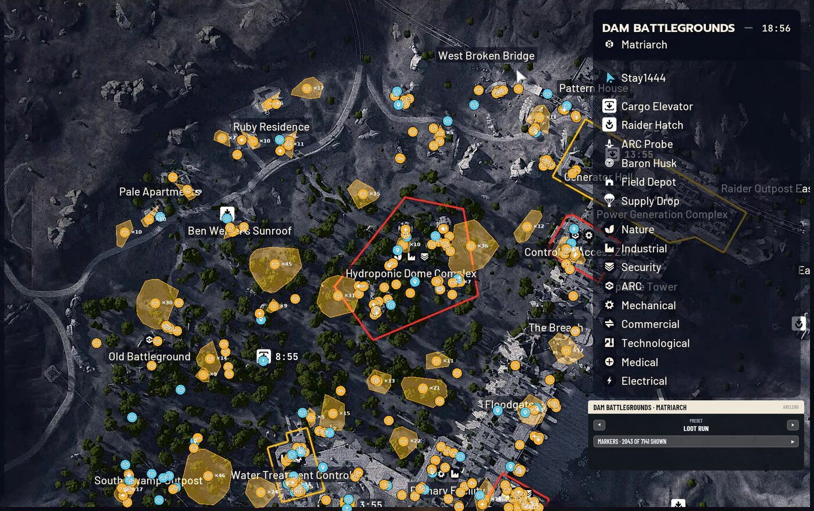
- **Marker tooltips.** Point at a marker or area to see its name and a line
  of info. (Works in headless tests; on KDE a fix is waiting to be
  confirmed, see the roadmap.)
  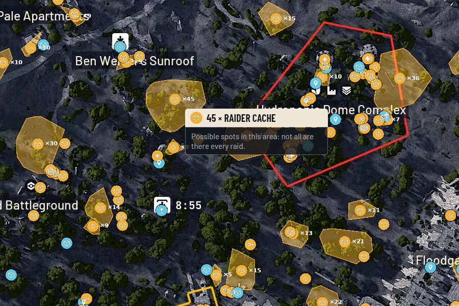
- **Map presets in game.** A small panel beside the map switches marker
  presets (Loot run, Ways out, ARC threats, Quests, Gathering, a preset per
  condition, …) with its arrows, and filters markers by category.
  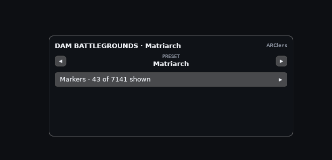
- **Main-menu card.** On the game's main menu, a card under the Quests box
  shows the map conditions running now and next with countdowns, and your
  workshop, quest, project and blueprint progress.
  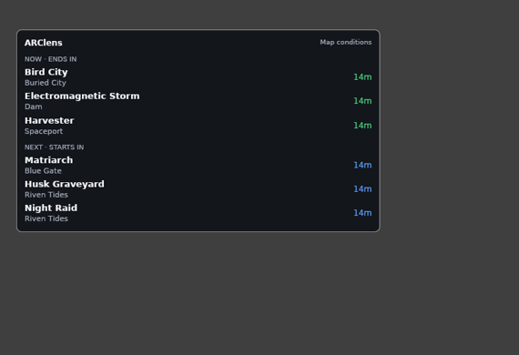
- **Quick search and item windows.** In interactive mode (Ctrl+Shift+I) a
  search box at the top of the screen finds any item; Enter or a click
  opens its window with everything the data has: verdict, values, weight
  and value per kg, stats, what it recycles and salvages into, its recipe
  and bench, what it crafts, upgrade tiers and costs, repair, which
  traders sell it, mod slots, where it's found and your progress on what
  needs it. Open several side by side; ✕ or Esc closes them.
  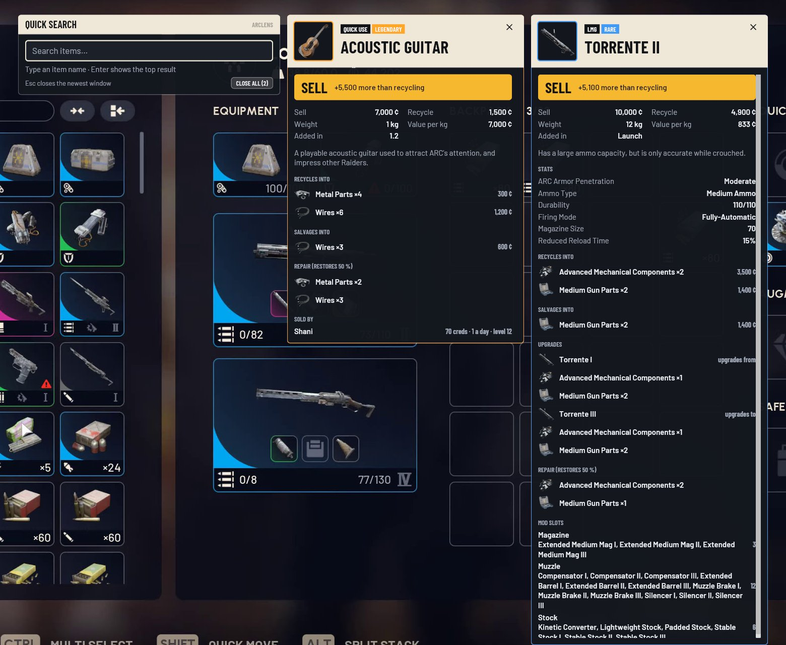

### In the companion app

- **Home**: game, capture and overlay status, item lookup, conditions now
  and next, the last map seen in game, workshop progress.
  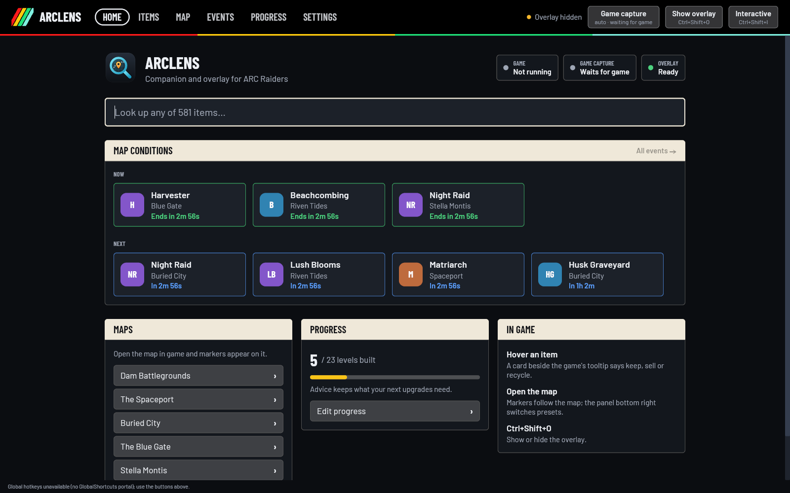
- **Items**: fuzzy search over the whole catalogue with the same advice
  card, recycling, crafting uses and "needed for" (quests, workshop,
  projects).
  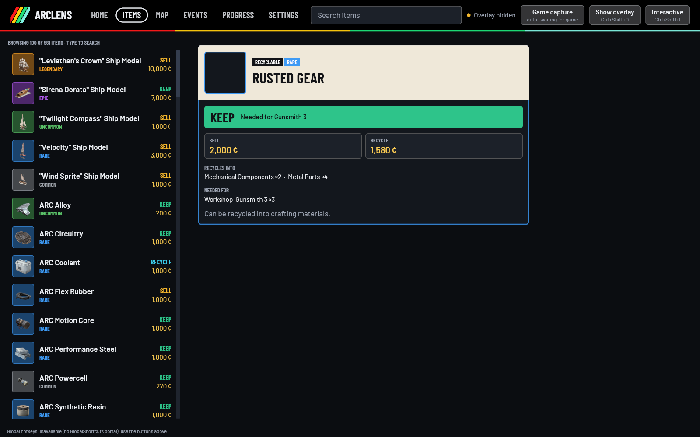
- **Map**: the map itself with every marker on it (scroll to zoom, drag to
  pan), map picker, marker search, category toggles with counts, spawn
  areas, and preset management (save, update, delete, reset per map or
  condition).
  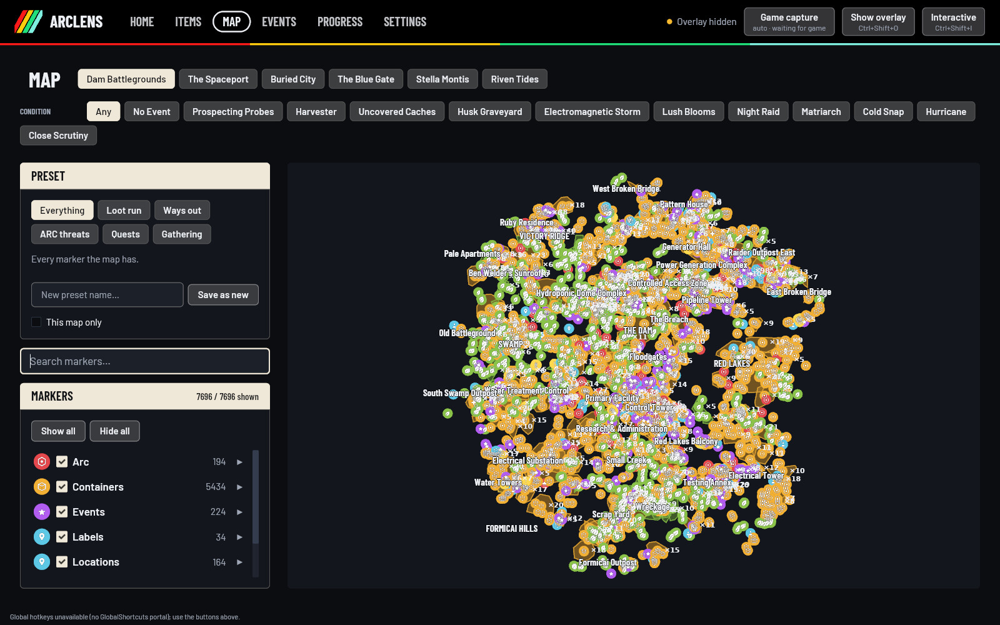
- **Events**: map-condition timers for your server region: what runs now,
  what's next per map, and the schedule per condition in local time.
  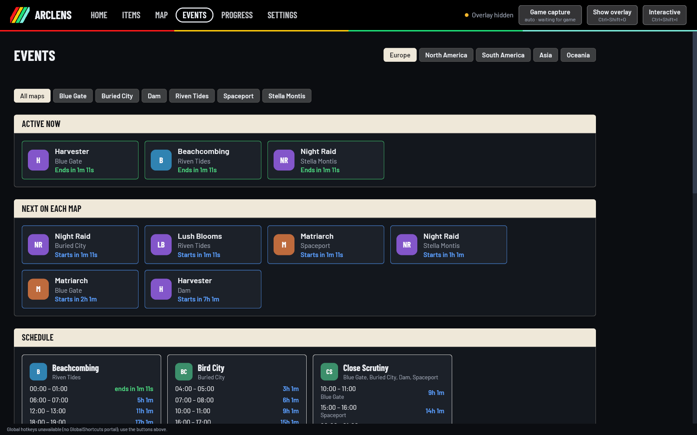
- **Progress**: workshop levels, finished quests, delivered project phases
  and learned blueprints. Advice uses them: items stop being KEEP once the
  upgrade or quest that needed them is done. Most of it fills in by
  itself: open the Workshop tab (all station levels) or a station, and the
  logbook or a trader's quest page (quests in progress mean the ones
  before them are done).
  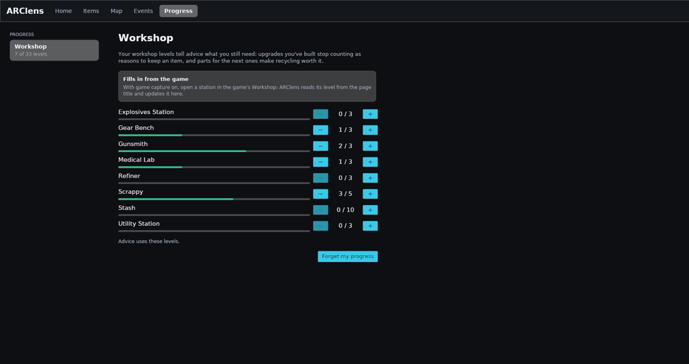
  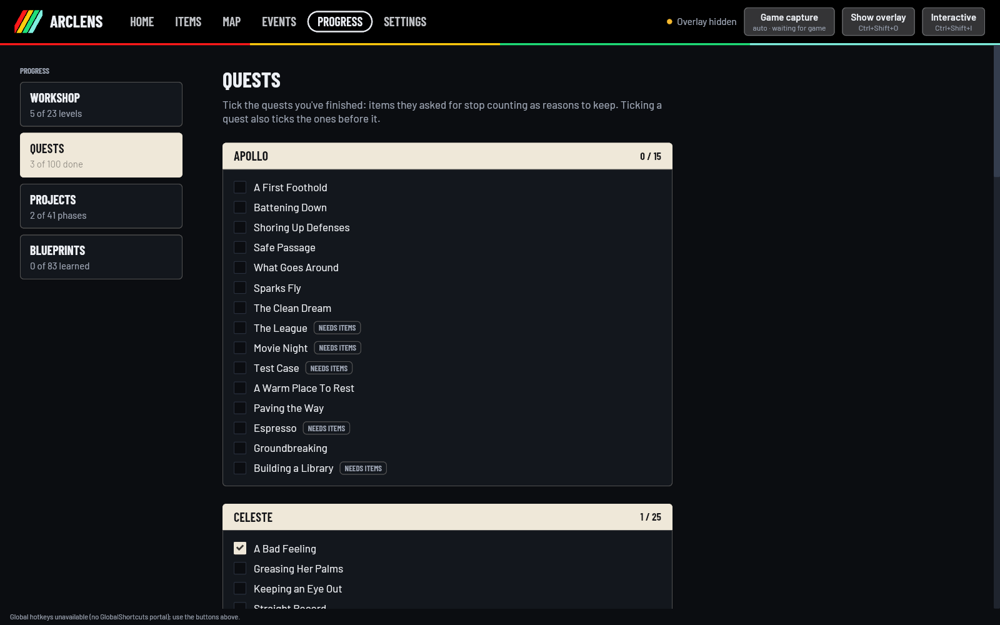
- **Settings**: language (English or Spanish; follows the system by
  default), overlay size (80–150 %), background opacity, which corner the
  pinned card uses, how often data is refreshed, and server region.
  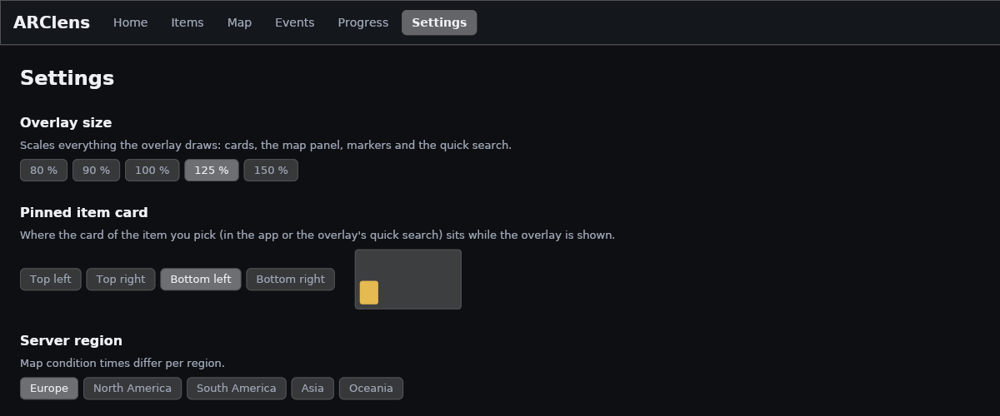
- **Languages**: English and Spanish (Spain) for the app and the overlay.
  Item, quest and station names come from the game data in that language,
  and items are recognised whichever language the game itself is in.
  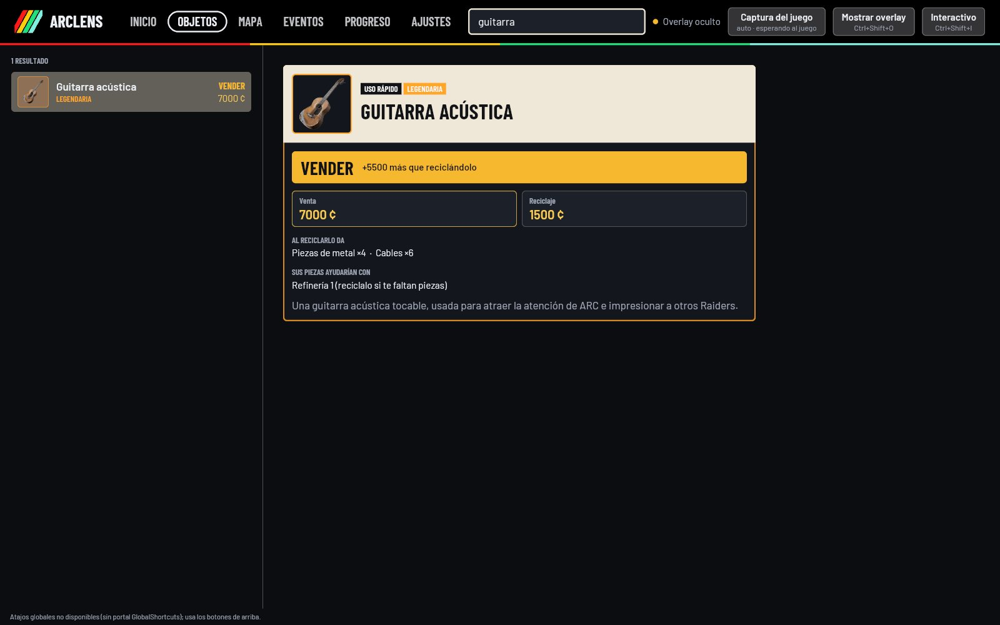

### How the advice works

- **KEEP** when an item is still needed for a workshop upgrade, quest or
  project you haven't finished (as ticked on the Progress page).
- **RECYCLE** when its parts feed an upgrade you still need *and* are worth
  at least 60 % of its sell price.
- **LEARN** for a blueprint you haven't learned yet.
- **SELL** otherwise, with a hint when its parts would help.

ARClens can't see your stash, so it can't count how many of something you
already have.

## Install

### Releases

Each release on the
[releases page](https://github.com/Stay1444/ARClens/releases) has:

| File | For | Notes |
|---|---|---|
| `ARClens-<version>-x86_64.AppImage` | Linux | Needs glibc 2.39+ (Fedora 40+, Ubuntu 24.04+) and PipeWire on the host. `chmod +x` and run. |
| `ARClens-x86_64.flatpak` | Linux | `flatpak install --user ARClens-x86_64.flatpak`, then `flatpak run io.github.Stay1444.ARClens`. |
| `ARClens-<version>-windows-x86_64.zip` | Windows | Unzip and run `arclens.exe`. |

Not on Flathub or COPR yet. The packages haven't been fully checked on a
real desktop yet (portals inside the Flatpak in particular); reports are
welcome. Details in [docs/packaging.md](docs/packaging.md).

### From source

You need stable Rust, 1.88 or newer, and, on
Linux, the Wayland, xkbcommon, Vulkan and PipeWire headers.

```sh
# Fedora
sudo dnf install wayland-devel libxkbcommon-devel vulkan-loader-devel \
    mesa-vulkan-drivers pipewire-devel clang-devel pkgconf-pkg-config
# Debian / Ubuntu
sudo apt install libwayland-dev libxkbcommon-dev libvulkan-dev \
    mesa-vulkan-drivers libpipewire-0.3-dev libclang-dev pkg-config

git clone https://github.com/Stay1444/ARClens
cd ARClens
cargo build --release -p arclens-overlay -p arclens
./target/release/arclens          # starts the overlay itself
```

## Usage

1. **Start ARClens**, then the game (or the other way round). The app
   starts the overlay and restarts it if it exits.
2. **Allow screen capture.** By default "Game capture" is on *Auto*: it
   starts when ARC Raiders is running and stops when it exits. On Linux
   the desktop asks once which screen to share; pick the one the game is
   on. The choice is remembered. In the Flatpak the app can't see the
   game's process, so set capture to *Always*.
3. **Check your server region** (Events or Settings tab), so the
   condition timers are right. It starts as a guess from your time zone.
4. **Play.**
   - Hover an item in your stash, at a trader or in a raid: the card
     appears beside the game's tooltip.
   - Open the map: markers appear and follow it. Use the panel's arrows to
     switch presets.
   - Open the Workshop tab or a station, the logbook or a trader's
     quests: your progress is saved to the Progress page.
   - Tick project phases and learned blueprints on the Progress page so
     the advice fits where you are.

Hotkeys:

| Keys | Does |
|---|---|
| Ctrl+Shift+O | Show or hide the overlay's pinned item card |
| Ctrl+Shift+I | Interactive mode: the overlay takes clicks and typing (quick search); press again to go back to click-through |
| Ctrl+1 … Ctrl+6 | Switch app tabs (Home, Items, Map, Events, Progress, Settings) |

On Linux the hotkeys go through the desktop's GlobalShortcuts portal: KDE
asks to confirm them once, and you can rebind them in System Settings →
Shortcuts. On Windows they are fixed.

## Platform support

| Platform | Status |
|---|---|
| **KDE Plasma 6, Wayland** (Fedora) | Primary target. Overlay over the game, click-through, hotkeys and live capture verified with Proton's native Wayland driver (`PROTON_ENABLE_WAYLAND=1`). Proton via XWayland (the default) not yet tested. Marker tooltips: fix pending confirmation. |
| **Other Wayland compositors with layer-shell** (Sway, Hyprland, other wlroots, COSMIC) | Should work; needs a ScreenCast and GlobalShortcuts portal. Only tested in headless Sway. |
| **GNOME** | Overlay not supported: GNOME has no layer-shell. The app itself runs. |
| **X11** | Not supported yet. |
| **Windows 10/11** | Builds, tests pass in CI and under Wine; not yet tested over the real game. Run the game **borderless windowed** (exclusive fullscreen hides any overlay). Only the primary monitor is captured. |

Proton notes: run the game normally through Steam. Don't add launch options
that load anything into the game (Vulkan layers such as MangoHud): ARClens
doesn't need them, and they muddy anti-cheat questions. On Wayland, Wine's
"exclusive fullscreen" behaves like borderless, so the overlay still shows.

The screen-reading features were tuned mostly on 2560×1440 recordings;
other resolutions, HUD scales, HDR or colour filters may read worse.

## Is this ethical?

A fair question for any tool that draws over a competitive game. Here is
exactly what ARClens does and doesn't do, so you can judge for yourself.

### What it does

- **Looks at your screen the way a screen recorder does.** The only window
  into the game is the operating system's screen capture: the XDG
  ScreenCast portal (PipeWire) on Linux, which you approve in a desktop
  prompt, and Windows Graphics Capture on Windows. It's the same path OBS
  and Discord streaming use.
- **Reads what the game already shows you**: the item name in a tooltip,
  place names and the map view, workshop levels, the quests in your
  logbook, the main menu. Then it looks those up in public community data.
- **Draws its own window on top** (a layer-shell surface on Linux, a
  topmost transparent window on Windows). It's click-through except where
  you need to click it.
- **Checks whether the game is running** by looking at the process list,
  the same list `ps` or Task Manager shows. It opens no handle to the game.

### What it never does

- No reading of game memory, not even "read-only".
- No injection, DLLs, `LD_PRELOAD`, Vulkan layers or hooks.
- No sending of keys or clicks to the game. Nothing is automated.
- No sniffing of the game's network traffic, and no use of Embark's private
  API or your account token.
- No reading of the game's files or logs.

These are hard rules for the project ([AGENTS.md](AGENTS.md)), for human
and AI contributors alike, and they're why ARClens works from pixels
instead of the much easier memory route. See
[docs/research/game-state-detection.md](docs/research/game-state-detection.md)
for the options we considered and rejected.

### Anti-cheat

ARC Raiders uses Denuvo Anti-Cheat. Embark's
[anti-cheat FAQ](https://id.embark.games/arc-raiders/support/faq/167-common-anti-cheat-questions)
allows overlays "only if they do not interfere with gameplay or offer an
unfair advantage", and publishes no allow-list.

ARClens is in the same technical class as Discord, Steam and streaming
overlays: a separate process, OS screen capture, its own window. As far as
we know nobody has been banned for an information overlay like this, but
**there is no guarantee**. Anti-cheat rules and detection change with
patches, and Embark hasn't reviewed or approved ARClens. **Use it at your
own risk.** If Embark says tools like this aren't allowed, we'll say so
here.

### Fairness

- Everything ARClens shows is **already public**: item values, recipes and
  requirements from community datasets, marker positions from community
  maps, condition schedules from community trackers. It saves you
  alt-tabbing to a wiki, nothing more.
- It **doesn't reveal hidden information**. No enemy or player positions,
  no loot through walls, nothing about what's actually in a container this
  raid. Map markers are community-mapped *possible* spawn spots, and the
  tooltip says so ("not all are there every raid").
- It only reads what's on your own screen, and only while it's shown to you.
- It **doesn't play for you**. No aim help, no crosshair, no macros, no
  input of any kind.

### Respect for data sources

- Only sources with a public API or an open licence, used on their terms,
  with responses cached so we don't load their servers (game data for a
  day, markers for a day, the schedule for 30 minutes).
- No scraping of sites without an API. The one exception is a one-off,
  offline extraction of the game's own place names from MetaForge's map
  page, which the maintainer decided on and which is documented in
  [data-sources.md](docs/research/data-sources.md). The app never fetches
  that page.
- Credit goes where it's due: see [Data and attribution](#data-and-attribution).

### Privacy

- **No telemetry, no accounts, no analytics.**
- **Screen frames stay in memory.** They're analysed and thrown away, never
  written to disk or sent anywhere.
- The only network requests are downloads of public data: the RaidTheory
  dataset (GitHub), MetaForge's markers and schedule, condition icons
  (MetaForge / arctracker.io CDNs) and, once, the OCR model (~10 MB, from the
  [ocrs](https://github.com/robertknight/ocrs) project).
- Your progress, presets and settings are plain JSON files in your config
  directory (`~/.config/arclens/`, or under `~/.var/app/` in the Flatpak).

### Lines we won't cross

ARClens would become unethical, and we won't build it, if it:

- touched the game process in any way (memory, injection, hooks, input);
- showed anything the game hides from you: other players, enemies through
  walls, actual loot contents;
- automated any part of play (aiming, looting, selling, crafting);
- used Embark's private API, captured account tokens, or sniffed traffic;
- scraped sites against their terms, or took data without credit;
- collected data about its users.

Pull requests that cross these lines will be closed.

## Data and attribution

- **Game data** (items, recycling, crafting, quests, workshop, projects),
  map images and map-condition icons:
  [RaidTheory/arcraiders-data](https://github.com/RaidTheory/arcraiders-data)
  (MIT), by the team behind [arctracker.io](https://arctracker.io).
- **Map markers and the map-condition schedule** (with its icons):
  [MetaForge](https://metaforge.app/arc-raiders), through its
  [public API](https://metaforge.app/arc-raiders/api). Thanks to the
  MetaForge team. Responses are cached to keep their load low.
- **In-game place names** used to line markers up with the map: extracted
  once from MetaForge's map page (they are the game's own names and
  positions; see [data-sources.md](docs/research/data-sources.md)).
- **Text recognition**: [ocrs](https://github.com/robertknight/ocrs) and its
  recognition model.
- **Fonts**: [Barlow and Barlow Condensed](https://github.com/jpt/barlow)
  by Jeremy Tribby, under the SIL Open Font License
  (`crates/arclens-ui/assets/fonts/OFL.txt`).
- **Map-marker icons** are ARClens' own (`crates/arclens-ui/assets/markers`).
- ARClens is a community project, **not affiliated with or endorsed by
  Embark Studios**. ARC Raiders and all related content are © Embark
  Studios AB.

## Development

- [AGENTS.md](AGENTS.md): project rules (read the hard rules first) and
  layout. Also [CONTRIBUTING.md](CONTRIBUTING.md).
- [docs/development.md](docs/development.md): setup, environment variables,
  replaying recorded frames, headless screenshots.
- [docs/architecture/overview.md](docs/architecture/overview.md): the two
  processes (app and overlay), crates and platform backends.
- [docs/ROADMAP.md](docs/ROADMAP.md): what's done and what's next.
- [docs/research/](docs/research/): data sources, game-state detection,
  map tracking, Wayland overlay and Windows notes.
- [docs/packaging.md](docs/packaging.md): AppImage, Flatpak and Windows
  builds, and how to cut a release.

```sh
cargo fmt --all
cargo clippy --workspace --all-targets -- -D warnings
cargo test --workspace
```

## Licence

ARClens is free software under the
[GNU General Public License, version 3 or later](LICENSE)
(`GPL-3.0-or-later`): you may use, study, share and change it, and
versions you distribute must stay under the same licence with their
source available.

Game data, fonts and icons that ARClens downloads or ships keep their own
licences; see [Data and attribution](#data-and-attribution).
